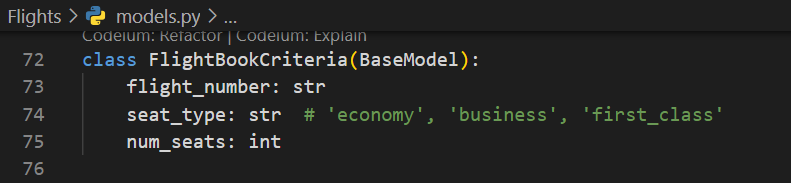
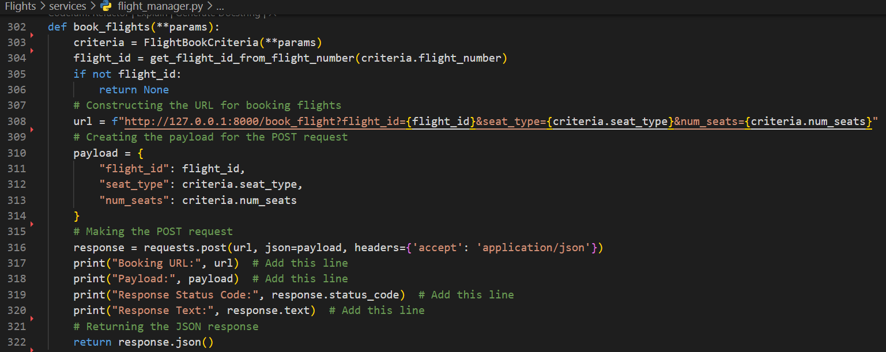
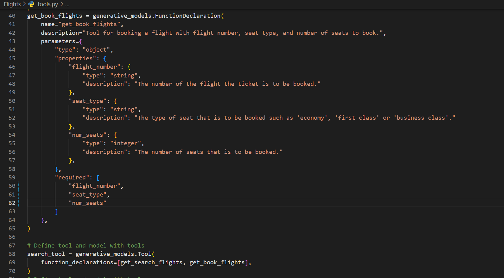
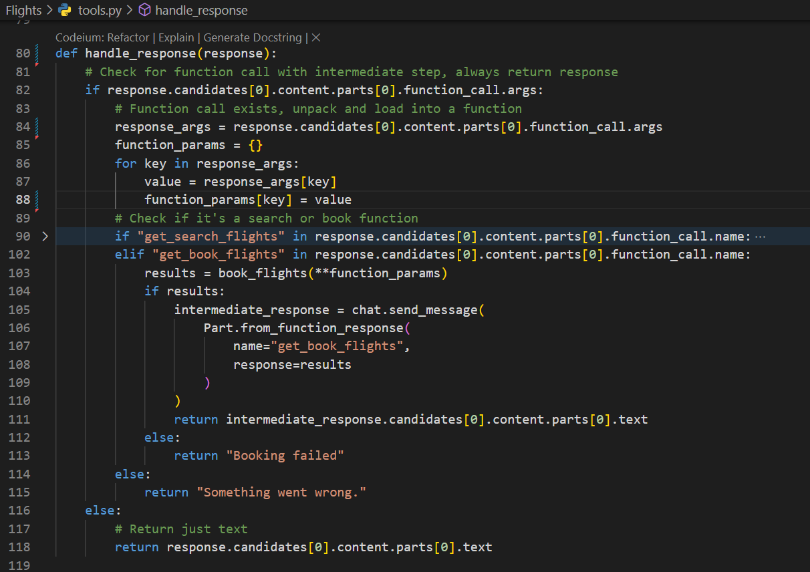

# Gemini Flights 

## Description

Gemini Flights is an intermediate level mission created by Mikhail Ocampo at RadicalX. The app was set up in a way that it introduces itself as a Google Gemini Powered agent which helps the user with flight details such as searching for available flights when the user gives a prompt to search for a flight with origin and destination on a specific date. The mission for the interns  is to create a booking tool for the app where it books a flight ticket for the user when prompted for a specific flight and seat type such as 'economy', 'business class', 'first class'.

## Steps Involved

### Step 1
Setting up Google Cloud Account. Create a project in Google cloud. Enable all recommended APIs in VertexAI section.
### Step 2
Fork premade fast API server from the provided link. Clone the forked GitHub account. Set up the Google Cloud project with the GitHub account and run the project on virtual environment, Backend and Frontend on separate terminals.
### Step 3
Integrate Google Cloud SDK for Vertex AI. Download, Install and initialize SDK and setup Python for VertexAI with proper authentication.
### Step 4
Define and load functions for Gemini Flights! Use FunctionDeclaration to craft the get_book_flights function, encapsulate it in a Tool class, and configure the GenerativeModel.
### Step 5
Implement a response handling system and integrate it with Streamlit for effective communication with Google Gemini. Ensure proper initialization of the chat session and handling of various response types.
### Step 6
Implement the book_flight function in Flight_Manager.py, define its function declaration, and update the tool class to bind the new function to Gemini for flight booking.

## How the frontend performs

## How the backend performs

## New code that was added

## Technologies used
### Tools used to build the project
1. Google Cloud
2. Google Gemini
3. Fast API
4. Streamlit
5. Vertex AI
6. Python
7. Visual Studio Code
8. GitHub

### Tools used to research 
1. ReX from RadicalX AI platform
2. Google 
3. Chat GPT

## Acknowledgment
- Thanks to Talha Sabri for this opportunity at RadicalX

- Thanks to Mikhail Ocampo for building this mission

- Thanks to Aniketh Rai for helping me solve some errors

## Loom Video Created 
Click [here](https://jam.dev/c/78af6b0f-1e5b-452e-9680-0275bbd1fc15) to wacth the demonstration.

## About RadicalX

RadicalX is pioneering an immersive digital world designed specifically for Gen Z developers.